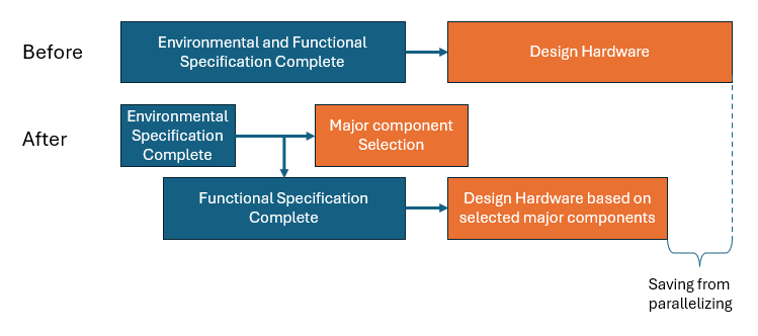

# Compression Techniques

Project compression techniques help reduce project duration without sacrificing quality. In VPM, compression is often needed when critical path slippage threatens key delivery dates. These techniques focus on changing task structure, scope, or resource allocation to regain schedule integrity. The goal isn’t just to go faster—it’s to recover control, align cross-functional teams, and keep stakeholders focused on shared outcomes.

The techniques below can be mixed and matched depending on the project’s needs. Choosing the right technique depends on the type of delay, the tasks involved, and the flexibility in scope, sequencing, or resources. Compression is a thinking process—not a mechanical one—so the right solution often emerges from structured visual collaboration across the team.

## Untangle Complex Sections of the Project

Untangling is often the first step to shortening. When sections of the project are overly complex—filled with cross-functional dependencies, unclear handoffs, or bloated sequences—they tend to mask inefficiencies. Clarifying the actual flow of work often reveals places where time is wasted, steps are duplicated, or buffers are hiding in plain sight.

Once the flow is clear, teams can more easily spot opportunities to compress. Simplifying dependencies, removing unnecessary approvals, or breaking apart tangled tasks can unlock faster, smoother execution. In many cases, the act of untangling itself creates the chance to shorten without adding resources or removing scope.

This is especially powerful when applied to the **critical path**. A well-structured critical path should flow continuously from day one to project completion with no built-in slack (no space between two tasks anywhere in the path). Complex or unclear segments often introduce invisible buffers or misaligned timing. By untangling these sections, teams can expose and eliminate wasted time—frequently leading to meaningful schedule compression.

## Parallel vs. Serial Tasks

Some tasks that appear to be serial can be partially or fully parallelized. By identifying handoffs or dependencies that are more convention than requirement, teams can often overlap work or run tasks concurrently, reducing total duration. This is especially useful when the upstream output is predictable or when early access to partial information is enough to begin the downstream work.

Parallelization requires coordination and risk management—teams must understand what assumptions they’re making and be ready to adjust if those assumptions prove wrong. But in practice, it’s one of the fastest and lowest-cost ways to shorten schedules without reducing scope or quality.

## Splitting Throwing and Catching Tasks

“Catching” tasks are those that depend on upstream inputs. Splitting them allows part of the task to begin earlier with preliminary or partial information, while the remainder is completed when final inputs arrive. For example, documentation can begin with a draft spec, or testing can begin with prototype hardware.

This reduces the full duration of the task while maintaining quality and completeness. It does, however, require careful coordination to prevent rework and ensure the task finishes cleanly once all inputs are present.

“Pitching” tasks are those that generate outputs used by others. Splitting a pitching task allows early delivery of partial outputs that downstream tasks can begin working from, rather than waiting for the full task to complete. For instance, partial code modules, early mechanical prototypes, or draft documents can be handed off in stages.

This technique is especially useful when the early outputs are stable or clearly defined. It requires the upstream team to manage handoffs carefully and flag any changes that could affect downstream work already in progress.

## Moving Resources to the Critical Path

The simplest—and often most effective—move is to reassign skilled people from non-critical tasks to those on the critical path. This increases focus and capacity exactly where it's needed most, potentially cutting days or weeks off the schedule without changing scope.

Of course, this requires deprioritizing or pausing non-critical work. Teams must weigh the cost of delay in those areas against the value of finishing the project earlier. In well-aligned teams, this trade-off is obvious and uncontroversial.

## Scope Reduction: Delaying Tasks for a Later Phase

Sometimes a feature or activity is valuable, but not essential for the first release or milestone. In these cases, the work can be moved to a second phase or update, allowing the main project to finish on time. This is common in software and modular hardware designs.

This form of scope compression preserves long-term goals while enabling short-term delivery. It requires product management buy-in and clear communication with stakeholders so that no one is surprised when the delayed work resurfaces in a follow-up phase.

## Scope Reduction: Eliminating Features or Performance

Some scope elements can be removed entirely—permanently—for the sake of hitting a critical date. This might mean reducing performance, eliminating edge cases, or dropping optional features. It’s a tougher decision than deferral, but sometimes necessary.

Done well, this reduction is strategic and still delivers a strong product. It should be guided by customer input and business priorities, not just technical convenience. In many cases, what's eliminated was never strongly valued by users to begin with.

## Scope Reduction: Reducing or Delaying Variants

Variants—such as SKUs, localizations, or customer-specific configurations—can massively expand workload late in the project. Reducing or delaying these variants can unclog the path to launch by letting the core product ship first.

This technique can be combined with phased rollout plans or regional prioritization. The key is clear communication to sales, marketing, and customers so expectations are managed and trust is maintained.

## Targeted Resource Augmentation

Instead of increasing the entire team, targeted additions—such as a specialist or bottleneck role—can resolve specific delays. This is often more cost-effective than hiring broadly or throwing general help at the problem.

Examples include adding a firmware engineer to unblock hardware testing or bringing in a test automation contractor. The most effective augmentations are surgical: small, focused, and aimed directly at the constraint.

## Increasing Resources

A more general version of augmentation is simply increasing the number of people on the project. This can sometimes accelerate progress—especially on modular tasks—but can also create overhead and coordination drag.

Adding people works best on tasks that are clearly divisible and where the new team members can be productive quickly. Otherwise, the added complexity may eat up the time you're trying to save.

## Employing Third Party

Using a vendor, consultant, or contractor can bypass internal bottlenecks. This is especially useful when internal resources are maxed out or lack a specific capability.

Success here depends on clear scoping, tight oversight, and trust in the third party’s ability to deliver on time. It’s often best used for contained work packages rather than open-ended tasks.

## Increasing Team Capability or Capacity

Sometimes the best compression comes from making the existing team more capable. This could mean adding tools, improving processes, or giving focused coaching to unlock performance. A week of focused enablement can sometimes save a month of delay.

Another form of capacity increase is removing distractions—cutting meetings, eliminating low-value reporting, or pausing unrelated work. When people have more space to focus, work gets done faster and better.
