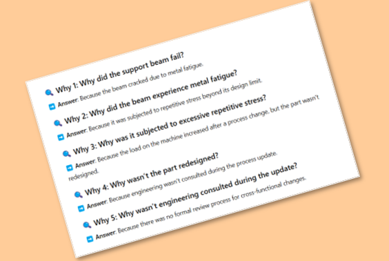
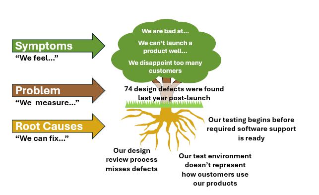
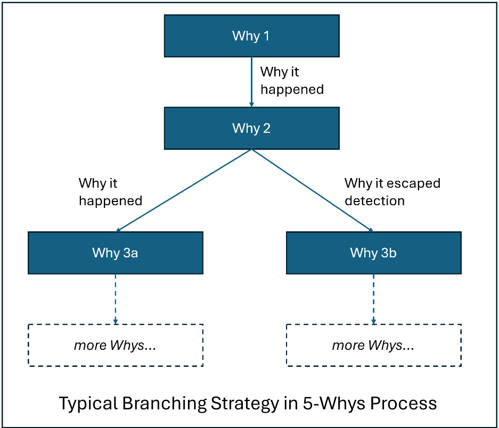

# 🧠 5 Whys Root Cause Analysis

Have you ever been in a team meeting where something went wrong—and after an hour of debate, you leave with nothing resolved? That’s usually because the group jumped to solutions without first getting agreement on **exactly what the problem was**.

The 5 Whys method was developed at Toyota to help teams do just that. In just 20 minutes, it can bring a group to consensus about what truly went wrong—and what to do about it. It’s not magic. It’s just **structured thinking done together**.

If you’ve never been part of a 5 Whys session before, don’t try to lead your first one solo. It’s harder than it looks. The conversation can easily veer into blame, or wander into rabbit holes. Some people may go silent, and you’ll miss valuable insight. People aren’t born knowing how to facilitate a good 5 Whys—so **find someone who has done it before**. Watch a few sessions. Then you’ll be ready to guide one yourself.

---

## 🎯 Purpose
The purpose of 5-Whys is to identify the **root cause** of a problem by repeatedly asking "Why?" until the true source is revealed and actionable. This method helps expose **process flaws** rather than placing blame.

---

## 🔍 Step 1. Preparing for a 5 Whys Session

Good results come from good preparation. Here’s how to set up a productive session that brings out the best thinking from your team:

### 1.1 📍 Hold the Meeting at the Source

Hold the meeting as close to the **place the problem occurred** as possible. If a lab test failed, meet in the **lab**, next to the test setup. If a design issue shows up on-screen, make sure everyone has access to **monitors or screen sharing** so you can explore the issue in real time.

This reflects the Lean principle of **“Go to Gemba”**—go to the actual place where the work happened. Seeing the problem directly is far better than hearing someone else describe it. Eyes beat words.

### 1.2 🧾 Use a Whiteboard or Shared File

Whether you’re in person or virtual, make sure there’s a **shared space**—a whiteboard on a shared screen or collaborative doc—where you can write each “Why.” You'll write each **why** as you go to ensure group **aligns step by step** to reduce backtracking and miscommunication.

### 1.3 👥 Assemble the Right Team

Make sure everyone needed to **fully understand the problem** is in the room. Missing even one person with key insight can derail the whole process. If a test failed, include the **tech who ran it**. If a customer is upset, include someone who **spoke to that customer** directly.  If a machine failed, pull in the **person who discovered the problem**.

### 1.4 ⏱️ Set Aside 30 Minutes

A typical 5 Whys session takes around **20 minutes**, but when you’re just starting out, it may take longer. Block **30 minutes of uninterrupted time** to avoid rushing and give the group the space to think clearly.

### 1.5 Clearly State the Problem
- Be specific and objective.  The problem statement should be simple and concise.
- Examples: 
"Customer received the wrong part."
"Machine 4 failed last night during wash cycle."
"The Nightly build failed three times last week."

---

## 👥 Step 2: Start the Meeting

Before you begin, set the tone: **This is not about blame**. It’s about finding opportunities to improve our processes.

We always focus on the **process**, because that’s something we can **fix and improve**. The problems we will deal with have root causes that fall into one of three buckets:
- **Process Failed** – the process exists, but it didn’t work.
- **Process Missing** – there was no process in place.
- **Process Not Followed** – the process existed, but wasn’t followed.  Be especially careful not to blame the person here.  There are always reasons why process isn't followed and it's almost never because someone didn't care.  Maybe it's hidden, hard to find, or confusing

### The Problem Tree
When leading discussions, separate insights between "symptoms", "problems", and "causes".  People often mix these types of insights where the goal of the 5-whys.  For example, when you ask "why did the design review from May miss the wrong screen dimensions", you hear something like "we always rush our reviews (**symptom**) and we miss dimensions all the time (**symptom**)."  Your response as a facilitator might be, "I think we all feel that, but **why** did we miss this isssue in the May design review?  Did we look at the dimension and miss the issue or did we not review that dimension, or was it something else?"  The **problem tree** helps people understand the differences between symptoms, problems, and causes.

Avoid talking about **solutions**.  Frequently, someone may make a comment like "we need to improve our design review reporting template."  A helpful facilitation response might be "that sounds like a good direction, but let's focus on causes in this meeting."

Make it clear this is a **blame-free zone**. People need to feel safe sharing what really happened. The goal is not to find fault with individuals—but to understand what in the system allowed the problem to occur. That’s where the real improvement lies.

- Avoid blame—focus on facts and **improvement**.

## ❓ Step 3: Ask "Why?"—Dig Slowly and Thoughtfully
This is the **heart** of the 5 Whys process. Many teams fail here by moving too quickly. The goal is not five answers—it’s one **root cause**.

#### 3.1 Start from Observation, Not Assumption
- Ask: *"What exactly happened?"*
- Use observed **facts**, not speculation.

#### 3.2 One Logical Step at a Time
- Build a chain: A → B → C → D → Root
- Ask: *"Can we observe or prove this connection?"*

#### 3.3 Use the Group to Avoid Leaps
- Pause and ask: *"Is this too big a jump?"*
- Designate someone to play the **slow-down voice**.

Sometimes the team moves too quickly and skips over a critical step. The “slow-down voice” helps the group stay grounded in logic and evidence.

**Before (Too Fast):**  
> *Why did the customer get the wrong product?*  
> → *Because we didn’t validate the order.*  
>  → *We need to implement a double-check system.*

**After (With Slow-Down Voice):**  
> *Wait—before we jump to solutions, let’s slow down. What exactly failed?*  
>  → *The wrong product was picked from the shelf.*  
> → *Why was the wrong product picked?*  
>  → *Because the shelf labels were incorrect.*  
> → *Why were the shelf labels incorrect?*  
>  ...Keep going from here

By slowing down, the team found a deeper process issue (the root of why the shelves were mislabeled) instead of jumping straight to adding complexity (a double-check system).

#### 3.4 Rule of Small Steps
Each Why should:
- Take <30 seconds to explain
- Verify with Evidence: Ensure each answer is supported by evidence or data. If an answer is hypothetical, mark it for further investigation rather than accepting it as fact.
- Be a simple answer to the question "why?"--don't analyze because that results in skipped steps, which feels like it's speeding things up but it's just the opposite.  Simple steps maintain consensus throughout the process, and so maximize speed to a solid end product.

#### 3.5 Avoid Premature Solutions
- Stay in **analysis mode**. No checklists yet.
- Keep going until you get to "Process Failed", "Process Missing", or "Process not Followed"
Don't accept: *"They weren’t paying attention."*
Ask: *"What made attention difficult in that moment?" or "Why does this process require such a high level of concentration?*

#### 3.6 Use a "Why Tree" Sparingly
- When people don't agree on a "why", sometimes it's because they are traveling down different mental paths.  One may be thinking "what were the physics of what made this happen", another may be thinking "how did the person's actions make this happen", and a third may think "how did we miss this at the design review".  All are valid and each may lead to different root causes.
- When there is disagreement, branching the "why tree" can be effective.  
- Branching is particularly useful when tracking three different aspects of a problem
  - What phyiscally happended
  - How did our decidions or work product make this happen
  - Why it went undetected
  - Why it caused so much harm 

- **Minimize use of branching**
- Use branching sparingly--every problem has more than one cause.  Use braching when it's required to keep consensus that you're on the main path.  While it can be tempting to chase every possible cause, branching too early in the 5 Whys process can derail the discussion. It scatters focus, encourages speculation, and often leads to shallow answers. The power of the method comes from disciplined depth, not breadth. By following the strongest path first, the group stays aligned and digs deeper into real process issues. Only after fully exploring one path should you circle back and test whether another branch is worth pursuing.
- Feedback process:  If there's more than one branch in a 5-why session, you're probably using the technque too often. 

#### 3.8 Process is the root
Stop when the cause points to a specific defect in a specific process or needed process:
- **Process Broken**--the process used didn't work
- **Process Missing**--there is no process for the problem
- **Process Overlooked**--there is a process but the team didn't follow it

--

## ✅ Step 4: 🕒 3-Minute Checkup
This step ensures the solution truly **addresses the root cause**.

Start at the end and work **backward**:

1. **Will our corrective measures eliminate the root cause?**
2. **If we eliminate the root cause, will it stop the cause before it?**
3. Repeat this logic **back to the problem**.

If at any point the answer is "maybe" or "partly," then the chain needs more work.

---

## 🛠️ Step 5: Take Corrective Action
- Identify a **process-level fix**, not just a patch.
- Assign responsibility and due dates.

---

## 📈 Step 6: Sustaining the Results
It’s critical to keep the team together during the sustain phase. All the problem-solving in the world won’t matter if the fixes don’t stick. The same team that worked through the 5 Whys should continue meeting every week or two until the issue is fully resolved and the new process is working reliably. Without this follow-through, the effort risks becoming just another meeting with no lasting change. Sustaining is where improvement becomes reality—and it only happens when the team stays engaged to see it through.
- **Monitor** the results.  Set up a weekly meeting until the improved process is put in place.  Keep the team together until you see results!
- **Confirm** the issue is resolved.  Ensure the process is standard work for everyone executing the process
- **Develop training material** where necessary.  Use a simple wiki site like this or build a slide deck with your Continuous Improvement team.  Get the word out and make sure new people have access so the new process takes hold.
- **Share learnings** to prevent recurrence elsewhere.  Take 10 minutes at a department meeting to show what you learned.  Post a notification in chat groups.

 
 

# Topics to Help Guide Discussions to Real Improvement
The 5-Why process can wander off to false causes--causes that blame people camoflaged as process improvements.  Let's talk about a few so you can guide the conversation away from these topics.

## 🌿 "More Training" and "Try Harder" Solutions Usually Fail
Teams new to the 5-Whys process often jump to **training** or urging people to **try harder** because those solutions are easy, but they rarely treat the root cause.  Why are these solutions so tempting?

- ✅ They seem easy to implement.
- 😈 They shift the problem onto someone else.
- 🤷 They imply user error—not a broken process.

But these are low-creativity solutions.  Any problem can be made better if we trained people more often and better or if they would just try harder.  This isn't improving the process--it's getting people to exert more effort on the same process.   

Instead of jumping to **more training** or **try harder**, ask:
- *Why does this step require extra training, focus, or effort?*
- *Is it unclear?*
- *Is it too complex?*
- *Is it hard to find?*
- *Is it **unreliable**, but which we mean "too easy to complete incorrectly without realizing it?"*

Seek solutions that make the process better vs. trying to make people better.

That being said, if after thorough investigation, the team finds an obvious gap in these areas, it should be flagged.  If there is a training module developed for **design reviews** and there's no standard way for people to know they need training, then develop a training plan for the **Design Review Process**.  That means building a schedule and measuring compliance--not just sending an email to tell people to read a document.  This approach is especially relevant if the process miss is dealt with well in the existing training module.  Similarly, if someone missed an obvious issue in the well-designed lab process, one that's worked reliably in the past, that you might attribute that problem to insufficient focus or effort.  People work not feeling 100% well, with family distractions, and just after an argument with a colleague.  If a process that almost always works fails on the odd occasion, attributing it to a lack of focus can be reasonable.  So these causes are valid in limited cases, but use them sparingly.  

> ****
> ### 
Process that requires the perfect person on the perfect day is bad process.

> ### 
Good process processes work for normal people on normal days.

> ****

## 🧑‍💼Resources Are Never a Root Cause
Resources are never the true root cause. If a process was run with insufficient resources—whether that means too few people, unqualified staff, or inadequate tools—that’s not a process problem; it’s a planning or oversight problem. Better questions are: 

1. Why was the process planned to run without what it needed to succeed? 
2. Why wasn’t the resource gap identified and addressed when the process was being executed?  Is the team empowered through the process to "Stop and Fix" when the right people aren't available?
3. Are the qualifications to execute the process clear?  We are all aware that there is a process for a medical exam, but it must be executed by a qualified clinitian.

Root cause analysis should always dig deeper—past the surface-level excuse of “not enough resources”—to uncover the breakdown in decision-making, forecasting, or communication that let it happen. Never stop at resources. Keep asking why.

---

## 🪛 Build Feedback Into the Process
Good process not only guides action—it also provides **self-feedback**.  You can divide process into two types:  prescriptive and feedback.  Prescriptive process--documenting what must be done--is what most people think of a "process".  However, comprehensive process incldues feedback steps to confirm that prescribed steps were followed properly.  In the world of product development, processes are complex and it's unrealistic to think that every engineer, scientist and developer follow every process perfectly.  That's where feedback process comes in.

Feedback steps:
- Tell the user if their work was successful.
- Provide a clear signal when something went wrong.
- Close the loop—like a speedometer complements a speed-limit sign.

Processes should help people **see and correct mistakes themselves**. That’s the leap from good to great.

### 🔁 Examples of Feedback in Product Development Processes
The six examples that follow highlight common types of feedback in product development—both hardware and software. These feedback loops are everywhere, from prototype reviews to test results to supplier input. But despite being commonplace, they’re often informal and easily overlooked. Without deliberate steps built into the process to capture and respond to feedback, it can slip through the cracks—especially under time pressure. These examples illustrate the importance of intentionally designing feedback into the workflow to improve quality, reduce rework, and accelerate learning.

### 1. Prototyping & User Testing
**Feedback Loop**: Early-stage prototypes → user input → design revisions  
**Example**: Engineering builds a breadboard circuit, and field testers report that the interface is confusing. Design is updated before moving to PCB.

---

### 2. Experiment Review
**Feedback Loop**: Lab results → analysis → re-design of next experiment  
**Example**: A chemistry team sees unexpected yield drop at scale → re-runs bench tests with modified reaction time.

---

### 3. Design of Experiments (DoE)
**Feedback Loop**: DOE trials → performance analysis → parameter tuning  
**Example**: Material scientists test different cure times for adhesives → analyze adhesion strength → narrow future tests to high-performing time range.

---

### 4. Peer Technical Reviews
**Feedback Loop**: Design or code walkthroughs → peer feedback → design or implementation updates  
**Example**: A software engineer proposes a new algorithm → peer review finds performance issues → code is reworked with better efficiency.

---

### 5. Postmortems & Retrospectives
**Feedback Loop**: Failed or delayed projects → root cause analysis → process or tool improvement  
**Example**: A failed prototype triggers a review, revealing late-stage spec changes as the cause. A new process is adopted to freeze specs earlier.

---

### 6. Voice of Customer (VOC) or Market Input
**Feedback Loop**: Customer usage or complaints → redesign or feature reprioritization  
**Example**: Early customers find an R&D-developed UI feature unintuitive → UX team conducts studies and simplifies the flow.

---

## 🌳 Examples: 5-Whys for Product Development Issues (including Branching)
The two examples provided are drawn from product development—one in hardware and one in software. Both include branching, where multiple causes were explored before narrowing to the most likely root. This reflects the reality of complex development work, where multiple contributing factors often coexist. These examples demonstrate the kind of slow, deliberate thinking that a 5 Whys session should generate. Rather than jumping to conclusions, the team moves step by step, examining how each link in the chain led to the outcome. That’s the real power of the method: creating shared understanding through structured inquiry.

## Example 1: 5 Whys for Beam Failure Due to Metal Fatigue

**Problem**: A critical support beam in a production machine failed unexpectedly.

**Why 1**: Why did the support beam fail?  
**Answer**: Because the beam cracked due to metal fatigue.

### Branch 1

**Why 2 (Branch 1)**: Why did the beam experience metal fatigue?  
**Answer**: Because it was subjected to repetitive stress beyond its design limit.

**Why 3 (Branch 1)**: Why was the beam subjected to excessive repetitive stress?  
**Answer**: Because the load on the machine had increased after a process change, but the part wasn't redesigned.

**Why 4 (Branch 1)**: Why wasn't the part redesigned when the process changed?  
**Answer**: Because engineering wasn’t consulted during the process update.

**Why 5 (Branch 1)**: Why wasn't engineering wasn’t consulted during the process update?  
**Answer**: Because the redesign was carried out as an operations project to reduce cost and that process doesn't include consulting engineering.

### **Root Cause (Branch 1)**: Poor cross-functional communication during process changes – engineering not involved in risk assessment.  

---

### Branch 2

**Why 2 (Branch 2)**: Why was the fatigue not detected earlier?  
**Answer**: Because there was no routine inspection for microcracks in high-stress components.

**Why 3 (Branch 2)**: Why was there no inspection routine for fatigue-prone components?  
**Answer**: Because the maintenance checklist didn’t include fatigue checks for structural elements.

**Why 4 (Branch 2)**: Why didn’t the maintenance checklist include fatigue checks?  
**Answer**: Because past failures of this type had never occurred, so it wasn’t considered a risk.

### **Root Cause (Branch 2)**: Incomplete preventive maintenance planning – critical risk not anticipated.

---

## Example 2: 5 Whys for Software Failure

**Problem**: Users report that the mobile app crashes on login after the latest update.

**Why 1**: Why does the app crash on login?  
**Answer**: Because the app encounters a null reference exception when checking user credentials.

### Branch 1

**Why 2 (Branch 1)**: Why is there a null reference?  
**Answer**: Because the authentication token is not initialized for returning users.

**Why 3 (Branch 1)**: Why isn't the token initialized for those users?  
**Answer**: Because a new caching layer was added that skips initialization in some edge cases.

**Why 4 (Branch 1)**: Why did the caching layer skip initialization?  
**Answer**: Because the edge case logic wasn’t clearly documented or reviewed during implementation.

### **Root Cause (Branch 1)**: Incomplete documentation and code review of new caching logic.  

---

### Branch 2
**Why 2 (Branch 2)**: Why wasn’t this caught during testing?  
**Answer**: Because the test suite didn’t include scenarios for returning users without recent activity.

**Why 3 (Branch 2)**: Why didn’t the test suite cover this scenario?  
**Answer**: Because QA test cases focused on new user flows and active sessions.

**Why 4 (Branch 2)**: Why was QA focused only on new and active users?  
**Answer**: Because requirements didn’t explicitly call out handling of dormant user accounts.

### **Root Cause (Branch 2)**: Gaps in QA coverage due to narrow test planning and unclear requirements.

---

**Summary**: In these examples, asking “Why?” revealed multiple contributing causes—one related to the **technical flaw**, and the other to the **oversight in detection or validation**. Addressing both is necessary for long-term prevention.

---

# Conclusion
The 5 Whys method is a simple but powerful tool to uncover the root causes of problems—not just symptoms. When done well, it builds alignment, avoids blame, and points teams toward meaningful process improvements. Remember: it’s not about finding someone to fault—it’s about learning where our systems failed us. With practice and trust, this method becomes a cornerstone of a continuous improvement culture.

## 📚 References

- [Toyota Production System: Beyond Large-Scale Production](https://www.amazon.com/Toyota-Production-System-Beyond-Large-Scale/dp/0915299143) by Taiichi Ohno  
- [Managing to Learn: Using the A3 Management Process](https://www.amazon.com/Managing-Learn-Management-Problems-Agreement/dp/1934109207) by John Shook (Lean Enterprise Institute)  
- [Understanding A3 Thinking: A Critical Component of Toyota's PDCA Management System](https://a.co/d/0chYH3m) by Durward K. Sobek II and Art Smalley  
- [ASQ.org](https://asq.org/quality-resources/five-whys): "5 Whys Root Cause Analysis"   

---
