# Toyota A3

The A3 is a one-page visual tool designed to reduce information friction and simplify problem understanding. It consolidates complex narratives into a clear, structured layout that helps teams grasp issues, explore solutions, and agree on next steps—all at a glance. Based on Toyota’s A3 method, this canvas-style document encourages reflection, iteration, and clarity.  A well-crafted A3 reveals a team’s thinking. The structure compels users to clarify assumptions, validate facts, and build a shared story. This clarity allows others to give useful feedback—not just opinions, but grounded responses to a visible argument. In a fast-moving or cross-functional environment, an A3 becomes the frictionless artifact around which alignment grows.  The method was created by Toyota in the mid 20th century and brought to the West by John Shook in his seminal work, *Managing to Learn* from 2008 which will be referred to frequently here.

> *Toyota’s insight many years ago was that every issue an organization faces*
> *can and should be captured on a single sheet of paper.*
> *This enables everyone that touches the issue to see through the same lens.*
>
> — *John Shook, Managing to Learn, Pg 7*

The A3 process is iterative. Your first version? It’s usually just your take on the problem—your understanding, your assumptions, your proposed direction. That’s totally normal. But an A3 isn’t meant to stay that way.  
As you share it, talk it through, and get feedback, the document evolves. People push back, offer better data, point out blind spots, and sometimes propose completely different angles. It becomes a tool for building shared understanding—a structured way to gain and visualize consensus. By the end, what you have is no longer just your A3—it’s the organization’s A3. It reflects a more complete view and is far less likely to be skewed by one person’s perspective.  This takes time. Most A3s take 1 to 3 weeks to complete. And yes, there’s often a bit of horse trading involved—people negotiate wording, scope, priorities. That’s not a bug; it’s part of the process. The goal isn’t perfection—it’s alignment.

## When to Use the A3 Method

The A3 method is especially helpful when problems cross silos, span weeks or months, or have multiple interpretations. In these cases, verbal updates or loosely written summaries often cause misalignment. The A3 instead forces structure. It can be updated week by week to reflect new learning, becoming a shared and evolving reference point.  Examples include:
- Clarify a problem that has multiple stakeholders
- Align a team around evidence and root causes
- Create a visual single-point-of-truth that is easily updateable
- Communicate status without relying on slide decks or long reports

It is particularly useful in:
- Kicking off formal problem solving.  It can be used before the formal problem solving method is selected; in fact, it can help the team in selecting the best technique.
- Decision-making forums such as leadership meetings and meetings about projects encountering issues, especially when there is a need to renegotiate project scope, schedule, and resources. 

## How to Use the A3 method
A good A3 tells a complete story in a format that fits within a single visual view—whether printed on a physical sheet or projected on a digital screen. It is easy to comprehend the problem and invites colleagues and stakeholders in through clean 

Avoid scrolling, flipping, or needing to zoom in and out. It should be readable at a glance from a comfortable distance, typically 1.5–2 meters.  If your A3 doesn’t spark conversation within 30 seconds of someone looking at it, it’s probably too dense or too vague. Use visual hierarchy—headings, grouping, whitespace—to guide the reader’s eye. Most of all, focus on insight, not documentation. The A3 is a tool for engagement, not a report to file away.

## Managing to Learn
Managing to Learn is a practical guide to lean leadership and problem-solving, told through the lens of the A3 process. It follows a fictional story of a new manager, Porter, as he learns to solve a complex problem using the A3 method under the mentorship of his boss, Sanderson. Through this narrative, the book illustrates not just how to fill out an A3 document, but how to think, coach, and lead in a way that develops people while solving real business issues.
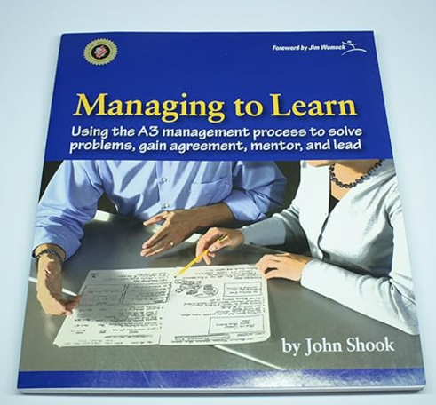

*Managing to Learn by John Shook (2008)*

What makes the book unique is its dual perspective format—one side of each page shows the learner’s point of view, and the other shows the coach’s. This structure highlights the learning journey, the importance of asking the right questions, and how leaders can guide others without giving them the answers. In the end, Managing to Learn is less about the document and more about the dialogue, reflection, and shared understanding that come from using A3 thinking well.

- Shook makes it clear there is no one right template for an A3.  in fact, every A3 takes on a unique format in order to maximize clarity for the problem being analyzed.  However, he does provide a starting point that I have found useful:  
[Sample from Managing to Learn](https://www.lean.org/wp-content/uploads/2021/01/Detailed-A3-Template-from-Managing-to-Learn.pdf).  A modified form of this will be used as an example for the process below.

- One of the most powerful messages in Managing to Learn comes quietly, tucked into the back of the book: five real A3s, each completely different in style, structure, and layout. They were included not as templates, but to make a point—there is no single "correct" format. The A3 is not a form to fill out; it’s a thinking process. The layout should serve the story, not the other way around. These examples reinforce the idea that clarity, logic, and alignment matter more than formatting perfection.  Here's a link to partial image of those A3s to highlight how different they can look depending on the story being told: [5 A3s from Managing to Learn](Art/A3/Shooks_A3s.png).  (This image is also shown at the end of this document.)

- Sensei-deshi (teacher-student) vs. team sport:  
One limitation of Managing to Learn is its reliance on a traditional sensei-deshi (teacher-student) structure. The book follows a one-on-one coaching relationship where a seasoned leader mentors a single learner through the A3 process. While powerful, this model can be hard to replicate in most Western organizations, where dedicated coaching roles are rare and time is limited. In our approach, we adapt the method by replacing the single sensei with a cross-functional team, using a process called Nemawashi—a collaborative, iterative way to build understanding, alignment, and buy-in. We will discuss Nemawashi in detail below, but the key point here is that Nemawashi allows diverse voices to shape the A3 and ensures that the thinking is broader, more resilient, and not overly influenced by one person’s perspective.  In a sense, the rest of the team serves as a sort of coach for the A3 owner.

## "A3" vs. "Canvas View"
The term A3 comes from the international paper size—roughly equivalent to US Tabloid (11x17"). That’s the size Toyota originally used to lay out the entire problem-solving story on a single sheet of paper. It was meant to be passed around, marked up, and discussed by teams standing side by side.

Today, though, you’re just as likely to be reviewing it on a screen during a virtual meeting. That’s why some teams now use the term “Canvas View”—a more flexible way to describe the format. The key idea remains: the whole story should fit in one view, like a canvas for a painting. You should be able to step back and see the big picture without flipping pages or scrolling endlessly.

The format adapts depending on how and where you’re working:
- **Sheet Canvas**: 11x17" for personal review or small teams
- **Screen Canvas**: Fit to a monitor or shared screen in digital meetings
- **Poster Canvas**: Printed large enough to be viewed from a distance by groups

"Canvas" denotes that the physical size isn't important.  You could view an A3 on an Oculus headset where it's a few inches across or on a 24-foot projector screen.  What matters is seeing the whole story in one view. 

*Three common forms of the Canvas view.  Only the first can be a literal A3 (Tabloid) sheet of paper*

### What defines a Canvas
- A canvas is defined as a single view of an issue that can be seen without **movement**.  Movement can be physical or digital. **Physical movement** would be walking along a long wall of printouts or having to step towards a poster to read small fonts and then stepping back to see the whole picture. **Digital movement** includes scrolling across a spread sheet or flipping through a slide deck.  Neither is acceptable in a canvas view.  In general, a canvas view means a person can interpret all information on a single sheet with no motion.  As a general rule, when a person is close enough to read the detail, entire document should be within a roughly 90 degree viewing span.
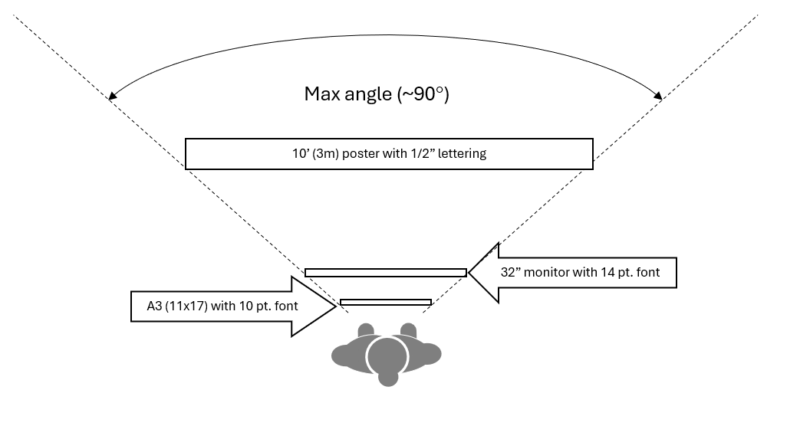
*A canvas view is one where the whole story is readable with a 90 degree viewing span*

## Text vs. Graphics
Graphics tap into a different part of the brain.  They convey the story faster and are more easily recalled later.  I often contrast the **visual superhighway** from the **cognitive logging trail**.  How slow would you have to drive a car if you blacked-out the windshield and had someone narrate instructions?  

Graphics allow your audience to absorb quickly.  Sure, they take more time to develop in your presentation, but that time is more than made up when you remember every minute you spend making the story easy to digest is more than paid for by many people being able to rapidly understand.  And that doesn't even count the lost opportunities when your story is so complex, some people won't make the effort to comprehend it.  Put in the hard work to make your story easy to follow.  Succinct text mixed with an ample set of graphics is the time-proven way to do that.

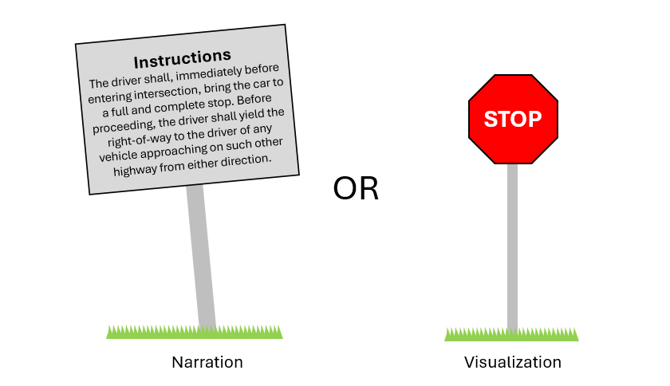

*The **cognitive logging trail** vs. the **visual superhighway**.*

- At first the A3 will be all text because it's easy to input
- Over time the A3 will get crowded and you'll be forced to convert to graphcis to recover space
- Convert graphs step-by-step as discussed next.

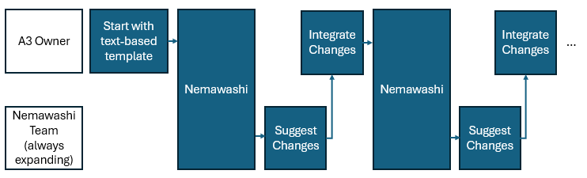

*Nemawashi is an iterative process*

### How to Convert text to full graphics along a spectrum of actions
Start by picking an area to work on—**analysis** is usually a great place to start because it’s often packed with opportunities for visual storytelling.  Think of this like a smooth transition from plain text to impactful graphics. Here’s the general flow:

- First, try simple formatting tweaks—things like **bold**, *italics*, _underline_, font size, or even color. It’s a small step, but it already helps key points stand out.
- Next, look at any tables. Can they be rephrased as sentences or simplified into bullets? Turning them into readable text can make them easier to digest.
- Then, start adding light visuals—move key phrases into shapes like arrows or starbursts, or drop in a few icons to guide the eye.
- When it makes sense, bring in charts, graphs, or other images that tell the story visually.
- And finally, don’t forget to annotate those visuals. A simple callout or label can make a big difference in clarity.

It won't happen all at once—just work through the flow step-by-step and watch your content come to life.

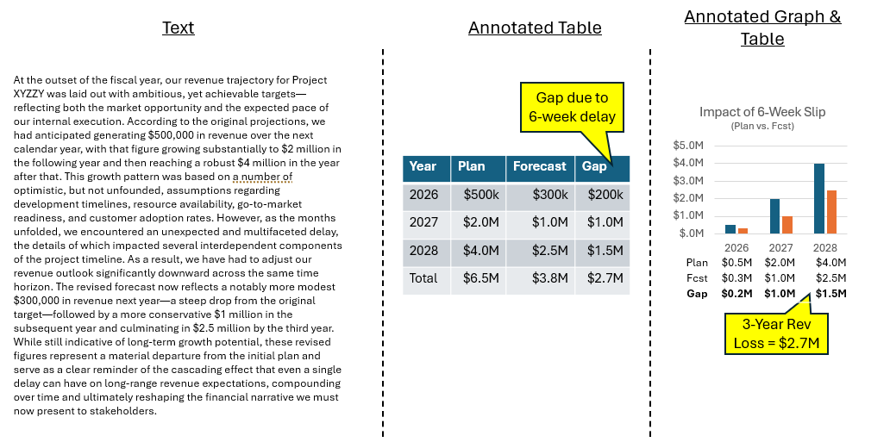

*Telling a story in rambling text vs an annotated graph or table.*

## When a Single A3 Isn’t Enough
If your story is too large for one A3, build a **hierarchical visualization** to keep the story digestible. This isn’t like a slide deck where each slide gives out a piece of the story. In the A3 process, **every canvas tells a complete story**, the same way a map might show a large area—say, the entire U.S.—but lets you drill down into a smaller region like New York. Each map still tells a full story. You only zoom in when someone wants more detail, and only after they’ve understood the higher-level view.

Be aware: most people just **starting** an A3 will say, “My story is too complex for one page.” That’s almost always not true. The hierarchical A3 is there as a fallback for rare cases when one page really isn’t enough—but it also helps end the “my story is too complex” conversation quickly. I usually say, *“Start with the high-level A3. If it turns out you need more detail, you can always build supporting A3s underneath it.”*

The truth is, once someone learns the A3 process, they usually find that one page is more than enough. In the **10 years I’ve been using A3s**, I can recall only one time we truly needed a hierarchical structure. We had five or six unrelated manufacturing issues on a custom product, and the customer was livid. We used one A3 to manage the commercial issue—how to organize our response and satisfy the customer. Then we created one technical A3 for each issue, allowing the engineers to work deeply on each problem without getting bogged down in commercial concerns.

It worked. The commercial A3 gave leadership and the customer a clear, consolidated view of progress. The technical teams had the space they needed to solve real problems without clutter. So yes, the option to build a hierarchy is there—but don’t be surprised if you start thinking you’ll need it, and discover that **one well-crafted A3** gets the job done.

## A3 Process
Think of the A3 as a storytelling tool—**customize it** to tell your story in the clearest, most impactful way possible. There's no need to follow a rigid format if another layout helps make your case more understandable.

Stay focused on the decision you’re trying to drive. Avoid slipping into complaints, listing risks without solutions, or making excuses. The A3 is about clarity and action, not venting.

Each section should use **clear, concise wording** and pair it with **visuals**—things like diagrams, graphs, icons, or simple tables. The goal? Create something people can walk up to, read in just a few minutes, and walk away saying, “Got it.”

> *It can't be stressed enough that there's no one fixed, correct template for an A3...*
> *The author decides what to emphasize depending on the specific situation and context.*
>
> *The A3 is not a form to be completed. It is a process—-a way of thinking*
> *and a means of developing shared understanding through dialogue.*
>
> — *John Shook, Managing to Learn, Pg 10*

### Sample A3
- Here is the sample we will be using to demonstrate the process of starting an A3.  This A3 describes the effect of a 6-week schedule slip and a path to mitigate it.  It's the sort of A3 you might see early in the process:  almost all text, no people signed on yet, and only on rev 2.   In that sense this example is meant to be the first iteration of an A3.  At the end, there will be examples from Managing to Learn by John Shook that will show what more complete A3s look like.  
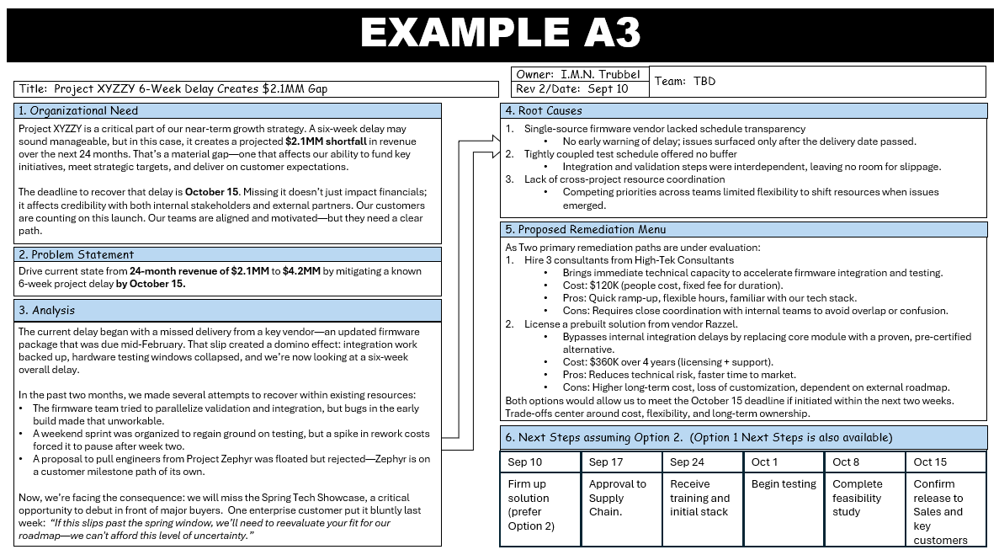 

*Starting A3 Template used in this document*

### Step A:  Getting Started

- Use the sample template above at [PDF version](Art/A3/A3%20Example.pdf) or [PPTX version](Art/A3/A3%20Example.pptx), or use Shook's initial template at [Sample from Managing to learn](https://www.lean.org/wp-content/uploads/2021/01/Detailed-A3-Template-from-Managing-to-Learn.pdf).

- Start on the left--gain alignment on the problem before you start solving.  Add text until no more fits and then create space incrementally by minimizing text and using graphics.

### Key Sections of an A3
- **Banner**: Administrative information like title and last update.
- **Team**: Define the group of people bought into the A3 story.  This gives visibility of data integrity for those out
- **Organizational Need**: Clearly state why this issue matters.
- **Problem Statement**: Quantify the current state and target condition.
- **Observation and Analysis**: Use tools like 5 Whys, Fishbone, or data visuals.
- **Root Causes**: Summarize the primary issues confirmed by the team.
- **Countermeasures**: Highlight actions (temporary and permanent).
- **Action Plan**: Define how progress will be tracked and verified.

This standard structure is adaptable. In exploratory work, you may lead with observations and delay defining the problem until insights emerge. In urgent operations work, you might flip the order—starting with countermeasures and working backward. The goal isn’t to check boxes but to clearly tell the story of thinking, testing, and adjusting.

#### Banner
The banner is the top row of the document with the title, owner, team, rev, and date.

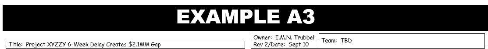

*Sample banner*

- Problem Title
- Team Members as they sign on.  At the start this will normally be just the owner.  As time goes on you'll use a process called **Nemawashi** which is described below to add team members one by one as people sign on to the story your A3 tells.
- Owner, the person driving the A3.  Many may be responsible for different parts of the A3 but there is always one accountable person.
- Date of Last Update

#### Team
Build a cross-functional team. You want different perspectives at the table—engineering, marketing, operations, finance—whoever can shed light on the problem.  Be inclusive. It’s better to ask someone and have them say no than to miss out on a valuable voice. You never know who might have the key piece of the puzzle.  Also, inviting people, even those that choose not to join, makes them less likely to feel left out of the process; they will be easier to win over as the A3 process continues.

## Step B:  Complete the left side
The left side defines the problem and the right side provides one or more solutions.  Start by gaining consensus on the problem before you begin discussing solutions.

#### Why this Matters to the Organization
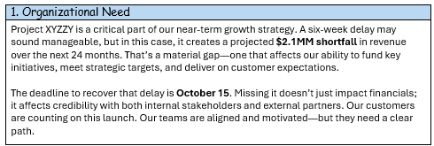

*Sample Organizational Need Section*

Start by explaining the business issues such as impact to revenue or cost, implications for customer satisfaction, and potential quality issues.  Avoid an antiseptic presentation.  Use emotion to tell the story so anyone leading the business can understand.  You may have complex technical issues, but here you'd avoid discussing science and engineering and focus on how the decisions about this issue affect the business.

#### Problem Statement
The problem statement is succinct, always in the form of:   
- from "current state" 
- to "future state" 
- by "date". 
In short form, FROM to by ". This is the primary quantitative description of the problem. Pick the units that most relevant to the business.

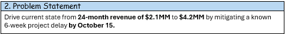

*Sample problem statement*

- Go from "current state" to "future state" by "date".  In short form, **FROM <X> to <Y> by <Z>"**.  This is the primary quantitative description of the problem.  Pick the units that most relevant to the business.  
- Example Problem Statement:  Take an example where a 6 week delay in Project XYZZY, we will change revenue from $4.2MM revenue to $2.1MM over the following next 24 months.  Moreover, the delay must be mitigated October 15 to avoid the revenue gap.  The problem statement would be:
- Problem:  Drive current state 24-month revenue of **$2.1MM** to **$4.2MM** by mitigating a known 6-week project delay by **October 15**.  Notice that the primary units are those of revenue, not schedule, because the primary impact to the business is revenue loss; the 6-week slip in the project is secondary in this problem statement.

#### Analysis
Analysis is where the story starts to take shape.  Bring in data, but more importantly, show insights—the kind that help guide real decisions. This is a great spot to use graphics right from the beginning. The goal? Make it easy for someone without a technical background to understand what’s going on, just like a good doctor explains things to patients so they can make informed choices.Leadership teams are sharp, no doubt—but they’re not always subject matter experts. So clarity really matters here.

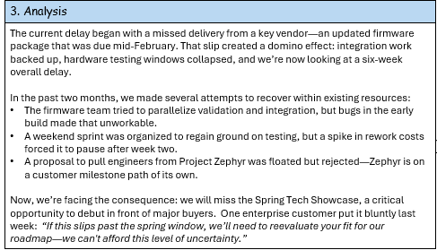

*Sample Analysis Section*

### Step C:  Left-Side Nemawashi
Nemawashi is quiet, behind-the-scenes engagement of those involved in the decision.  It is a sign of respect, allowing people to reflect, voice concerns, and shape the outcome before positions harden. In the context of A3 thinking, Nemawashi often happens as the canvas takes form—team members share early versions, gather feedback, and refine collaboratively. By the time the A3 is shared broadly or escalated, it already reflects the thinking of those involved, making consensus easier and more genuine.  Aspire to walk through the A3 with about half of the team you'll be presenting to; this way you'll wide agreement at the start. Never ambush people with surprise information, especially things that show people in a negative light or make others appear uninformed.

*Schematic of the iterative Nemawashi process*

- Do the first series of "Nemawashi" iterations of the A3 with just the left side.  This lets you define the problem as a team before you start solving.

- Find 2-4 colleagues who are knowledgeable, willing to provide feedback, and open to different ways of thinking.  Each time present your A3, taking feedback and adjusting A3 during meeting.  If you cannot put in the full scope of the change then add a call out to show them you’re listening, even if the full change can’t be made on the spot.

- In Left-Side Nemawashi, where you're focusing on the problem, you may only bring in a handful of people.  As you proceed to Right-Side Nemawashi, you pull in a broader group of functions and critical leaders.  Aim at minimum of 50% of the people you'll be presenting to.  This will make the presentation much more likely to flow smoothly.  

- Here's a short YouTube video discussing the process of Nemawashi with more detail:  

### Step D:  Complete right side
This is where we shift from understanding the problem to solving it.  The right side is all about defining a clear solution—or sometimes, a few options. We start with the root cause, then work our way toward practical recommendations. Think of it as building a bridge from insight to action.  By the end of this step, you should have a solid action plan that ties directly back to what you learned on the left side. No guesswork—just clear, thoughtful next steps.

#### Root Causes
Root Cause is about getting to the real reasons behind the problem—not just the obvious ones. We frame our root causes as hypotheses so we can test and discuss them openly, rather than treating them like conclusions set in stone.

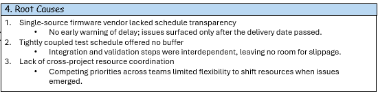

*Sample Root Causes Section*

- Focus on process—not people. The question isn’t “who messed up?” It’s “what process failed, was ignored, or was missing?” That shift in mindset helps keep the conversation productive and blame-free.

- Root causes to avoid:
 - ❌ **Person**:  Avoid blaming.  Even if a person made a mistake, remember good process should help people avoid mistakes or at least make mistakes obvious.
 - ❌ **Try Harder**:  Trying harder is a fleeting solution.  Any problem can be solved by a superhero,but good process works when people behave normally.  
 - ❔ **Training**:  Training can be "try harder" in camouflage.  If there is a process that lacks training or there is training that is not systematically taught, it can be a good choice.  But be wary of training because it's such an easy go to.  

- Root cause always falls into one of three categories:
 - ✅ **Process Ignored**: There was a process but we didn't follow it.
 - ✅ **Process Bad**: We followed the process, but it didn't stop the problem.
 - ✅ **Process Missing**: There is no process to deal with this situation
 
- It’s also smart to bring in the people most likely to feel responsible early in the process. Let them help shape the thinking—they’ll be more open and engaged if they’ve been part of the discovery, not surprised by it later.

#### Proposed Remediation Menu
At this stage, the team outlines a **menu of solutions**—usually two or three realistic options that range in scope and ambition. 
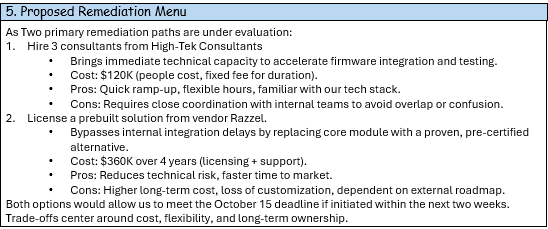

*Sample Solution Menu*

Present remediation along a spectrum of current state to systemic change:
- **What we’re doing now** – the current approach, often included as a baseline.  
- **A modest adjustment** – a targeted fix that addresses part of the problem with minimal disruption.  
- **A systemic change** – a more significant shift that goes deeper but often takes more time or investment.

No option will be perfect. The key is to put the known best options on the table, compare them fairly, and understand the trade-offs. That’s where **quantitative comparison** becomes essential. For each option, look at factors like:
- Impact on schedule  
- Cost or budget requirements  
- Projected revenue gains or losses  
- Customer satisfaction implications  
- Quality improvements or risks  
- Long-term business effects  

Avoid long descriptions or “word walls.” Instead, use a **table or structured visual** so the team can see everything at once. When decisions involve multiple dimensions, a table makes it easier to spot patterns, gaps, and standout options. This isn’t about flashy formatting—it’s about making thoughtful choices easier to see and discuss.

#### Schedule of next steps
Now that we’ve compared our options, it’s time to focus on the **recommended solution** and lay out a clear path forward.
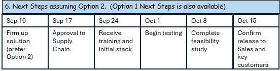

*Sample Next Steps Section*

Start by identifying any **major costs**—even if they’re just estimates for now. That helps the team and leadership understand the scale of investment involved.

Then break the plan down into steps, but here’s the key: **each step should be a measurable deliverable, not just an activity**. We’re not tracking effort—we’re tracking outcomes.

For example:
- ❌ *Action*: Hold a meeting with technical experts  
- ✅ *Deliverable*: Present to and get sign-off from technical experts

Each deliverable should have an **owner** and a **target date** so progress is visible and accountable. This turns the plan from a list of intentions into a set of commitments.

### Step E: Full Nemawashi
Be nimble. When someone gives you feedback, don’t just take notes for later—make the change right there if it makes sense. The A3 will go through many iterations before it’s ready for leadership, and that’s expected. It’s a living document.

As you go through each round of feedback—what we call Nemawashi—ask people if you can add their name to the team. Literally say, “Can I add you to the team on this?” You’d be surprised how often someone casually says they’re on board... until you ask to include their name. That’s when they take a second look—and that’s usually when you get the best, most honest feedback.

## Iterating the A3
As the Nemawashi process unfolds, you'll get many requests to add new perspectives.  This is a feature of an A3, not a bug.  This process erodes the biases of any one person because many points of view are represented simultaneously.  The problem is you will run out of space.  That's also a feature--having all the information on one page forces you to prioritize data and cull everything unnecessary to tell the story.  When you are asked to add information that doesn't fit, it's easy to fall into the traps of 1. Ignoring new information because it doesn't fit or 2. shrinking the font or cramming extra text into the margins. **Don’t.** Instead, take steps to create space for the most important information.

- Remove and compress "nice to have" information to make room for information critical to telling the story.
- Shrink space taken by reducing text--take out modifiers and articles, for example, 
 - from **We have a possible quality issue that could result in up to 10% of product being returned by customers before they even go in service.*
  - to *Quality Risk:  10% out of box failure return* 
  - or *Quality risk:  10% **OOB** (if **OOB** is understood by your audience as "Out of the box failures")
- Shrink space taken by going to compact tables, graphs, flow charts, and images.
- Remove or deprecate standard sections that add little--if "Next Steps" are not relevant to the problem, minimize or even remove it.  
- Combine two sections, for example, building simple next steps into your solution menu.
Every time you take one of these steps, your story becomes easier to understand *and* you create more space for richer context, new ideas, and fresh perspectives. That evolution—simplifying while deepening—is at the heart of what makes the A3 so effective.

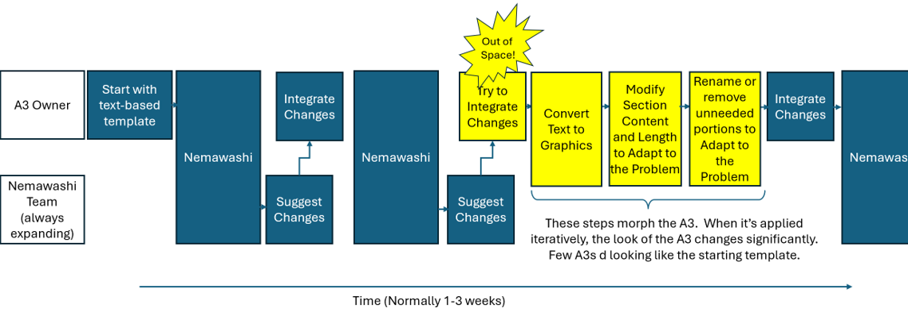

*Example of Text-to-Graphic Conversion*

### John Shook's 5 Sample A3's

Customize the template to express the problem the best way possible--the goal is to get good decisions quickly and the initial template is only a starting point.  The only rule is follow the canvas format:  tell your story so it can be digested from one view.  One of my favorite demonstrations of this principle is taken from John Shook's Managing to Learn where he places 5 Example A3s in the back pocket of the book that all look so different but each still fulfills that requirement. That's normal:  A3s usually start as text in a standard template and evolve in form as the story matures.  Note especially the center one in this picture, which appears more mature because of the extensive use of graphics.  

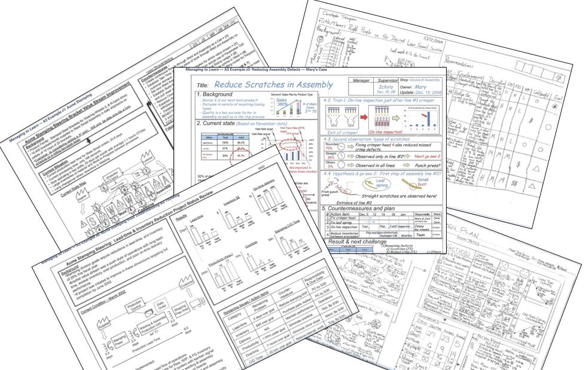

*John Shook's 5 Sample A3s demonstrate there is no one right A3 template*

# Conclusion

The A3 process is a rapid way to present complex issues, gain consensus and get high-quality decisions quickly.  You'll see the impact of a good A3 first with yourself.  As you craft the A3 to tell the story, your understanding of the problem increases.  You'll see it in colleagues as meetings that used to be arguments where you tried to convince others, you find yourself and your colleagues cooperating to tell the story in a comprehensive, unbiased manner.  And you'll see it in your leadership, whose frustration with confusing slideshows and unending discussion is replaced by clear requests and successful business decisions.