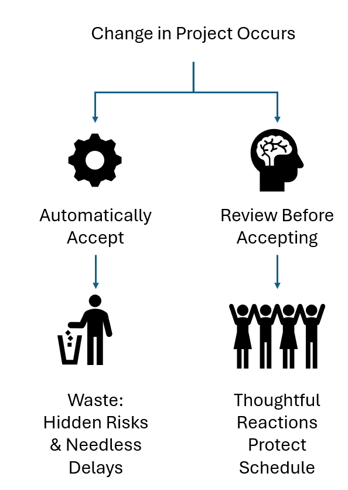

# [Wasteful Automation](WastefulAutomation)

- Many teams are eager to automate project processes—auto-calculated critical paths, automatic emails, self-adjusting schedules. But successful projects require an intelligent eye on every scope change, task expansion, and delay. Without that, automation can quietly lock in decisions that cause failure long after the fact. 

Here are three common examples:

1. **Scope changes** that are automatically pushed into requirements and treated as deliverables—without evaluating their impact on the project’s goals.

2. **Gantt charts** that extend timelines automatically when tasks grow—when a more thoughtful approach might restructure the work to avoid delays.

3. **Agile sprints** where stories are simply pushed to the next sprint—without reassessing scope, which could allow critical features to be delivered sooner.

-As Eiji Toyoda of Toyota said, you're responsible for the data you pass on. That means we must avoid systems that allow changes to slide through without human review and a search for smarter alternatives.

-VPM Works seeks to balance the efficiency improvement of automation for mundane tasks without creating wasteful automation that reduces the likelihood of team success.