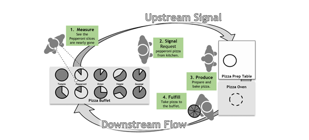
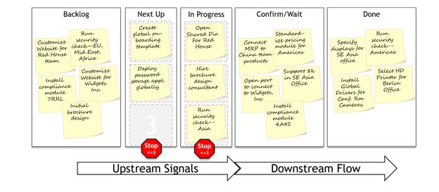

# Kanban Basics

> *"Kanban is like the board game Go: a few minutes to learn, a lifetime to master."* — Markus Skarin

## What Is Kanban?

**Kanban** is a visual workflow management system that enables **Just-in-Time Rationalization**. 

### Origins
- **Inspiration**: American supermarkets
- **Formalization**: Toyota inventory management  
- **Knowledge work adaptation**: David Anderson during Agile software movement

## The Pizza Buffet Analogy

### How It Works
1. Server notices pepperoni pizza running low
2. Signals kitchen staff
3. New pizza gets made
4. Appears before tray empties

### Key Elements
- **No planning meetings** required
- **No fixed schedules** to maintain
- Just **signals**, **capacity awareness**, and **response**
- This is a **pull system** in action

## Anatomy of a Kanban Board

### Common Software Options
- Trello
- Jira  
- Microsoft Planner/Lists
- Monday.com
- Physical boards with sticky notes

### Standard Column Structure

| Column | Purpose | Commitment Level |
|--------|---------|------------------|
| **Backlog** | Unlimited pool of requested work | No commitment |
| **Next Up** | Prioritized queue, ready for execution | Weekly commitment |
| **In Progress** | Work actively being done | Active commitment |
| **Awaiting Confirmation** | Completed, pending validation | Near completion |
| **Done** | Confirmed and finished | Complete |

### Critical Components

#### Kanban Cards
- Each sticky note represents **one task**
- Contains essential task information
- Moves left-to-right through workflow stages

#### Work-in-Progress (WIP) Limits  
- **"Next Up" column**: Limited capacity (e.g., 5-8 items)
- **"In Progress" column**: Limited capacity (e.g., 3-5 items)
- **Essential for smooth flow** — without limits, it's just a fancy to-do list

## No Commitments in Backlog

### Key Principle
- **Easy to add** new tasks to backlog
- **No commitment** to complete them
- Tasks selected only when among most important
- Selection happens in weekly meetings

### Common Misconception
> *"I've been asking for this for six months!"*

**Reality**: Age in backlog ≠ priority. High-value tasks frequently jump the line.

**Response**: If task isn't getting attention, make better case for its importance.

## Pull System Fundamentals

### David Anderson's Requirements
True Kanban systems must have:
1. **WIP limits** on columns
2. **Pull signals** for new work
3. Work moves only when capacity available

### Pull vs. Push
- **Push**: Tasks assigned regardless of capacity
- **Pull**: New work starts only when previous work completes

## Rationalization Integration

### Weekly Planning ("Next Up" Column)
- Where weekly rationalization happens
- Quick team meeting with stakeholders
- Select highest-value work fitting capacity

### Capacity Management ("In Progress" Column)  
- Where rationalization gets enforced
- Team takes on only what they can handle
- Typical timeframe: one week

### Commitment Levels
- **Backlog**: Requests only, no commitment
- **Next Up + In Progress**: Active commitments
- Everything else: Not committed

## Estimation Philosophy

### Traditional Approach Problems
- Dates negotiated early in process
- Misses trigger rework and rescheduling  
- Estimation becomes full-time job
- Multiple re-estimates for same task (waste)

### Kanban Alternative
- **Every task = single card**
- No sizing, complexity tags, or hour estimates
- Tasks flow one by one
- **Manage flow, not forecasts**

### Benefits of Less Estimation
- Priorities shift easily
- System stays adaptive  
- **Eliminates estimation waste**
- Commits at "last responsible moment"

## Ideal Use Cases

### Kanban Works Best When:
- Tasks are relatively independent
- Work arrives continuously  
- Projects are short or overlapping
- High variability in task types

### Common Domains
- **Engineering sustainment**
- **IT operations**  
- **Custom feature work**
- **Internal services**
- **Support and maintenance**

### When NOT to Use Kanban
- Large, tightly coordinated projects
- Fixed-timeline deliverables with many dependencies
- Work requiring extensive upfront planning

## Flow Principles

### Visual Management
- **All work visible** on board
- **Bottlenecks immediately apparent**
- **Progress obvious** to everyone

### Continuous Flow
- Work moves steadily through stages
- Blockers get immediate attention
- **Focus on flow, not individual task completion**

### Limiting Work in Progress
- **Reduces multitasking waste**
- **Improves focus and quality**
- **Exposes capacity constraints**
- **Enables better prioritization**

---

## Next Steps
- [Board Design and Setup](kanban_board_design_wiki)
- [Personal Kanban Board](kanban_personal_wiki)  
- [Performance Tracking and Improvement](kanban_performance_wiki)

---

*Kanban transforms chaotic small-task management into smooth, visible workflow that respects team capacity while delivering business value.*