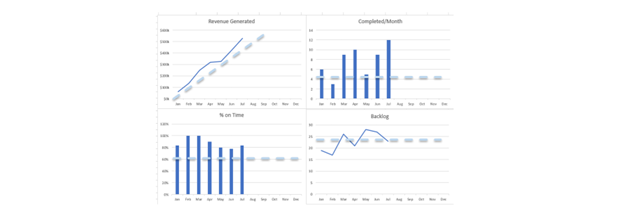

# Dashboards: Seeing Performance

## The Need for Dashboards

**The Kanban board shows flow. Dashboards show impact.**

### Board vs. Dashboard
- **Kanban Board**: Manages daily workflow and task execution
- **Dashboard**: Tracks business outcomes and long-term performance
- **Together**: Complete management system showing both flow and results

> *"The Kanban board helps us transact work. The dashboard helps us transform how we define success."*

## Core Dashboard Metrics

### Flow Metrics

#### Throughput
- **Tasks completed per week/month** — Team velocity measurement
- **Trending over time** — Capacity planning and improvement tracking
- **By work type** — Understanding different effort requirements

#### Cycle Time
- **Average time per task** — From start to completion
- **Distribution analysis** — Identify outliers and bottlenecks
- **By complexity** — Different task sizes have different patterns

#### Work in Progress
- **Current WIP levels** — Compared to established limits
- **WIP trends** — Growing or shrinking over time
- **Bottleneck identification** — Where work accumulates

### Business Impact Metrics

#### Value Delivered
- **Total business value** — Revenue generated, costs saved
- **Value per time period** — ROI measurement
- **Value by work type** — Which activities deliver most impact

#### Quality Indicators
- **Defect rates** — Rework percentage
- **Customer satisfaction** — Impact on end users
- **Compliance status** — Regulatory requirements met

#### Predictability
- **On-time delivery percentage** — Reliability measurement
- **Estimate accuracy** — How well team predicts completion
- **Commitment reliability** — Do we deliver what we promise?

### Operational Health Metrics

#### Backlog Management
- **Backlog growth/shrinkage** — Demand vs. capacity balance
- **Age of oldest items** — Work sitting too long
- **Backlog turnover** — How quickly items move through

#### Team Health
- **Workload distribution** — Balanced across team members
- **Utilization rates** — Not overloaded or underutilized
- **Blocking frequency** — External dependency issues

## Dashboard Design Principles

### Visual Hierarchy
- **Most important metrics** prominently displayed
- **Supporting details** available but not cluttered
- **Clear color coding** for status (green/yellow/red)

### Actionable Information
- **Trends over snapshots** — Show direction, not just current state
- **Context provided** — What good/bad performance looks like
- **Drill-down capability** — From summary to detailed analysis

### Stakeholder-Specific Views
- **Team Dashboard** — Operational metrics for daily management
- **Leadership Dashboard** — Strategic metrics for decision-making
- **Customer Dashboard** — Service quality and delivery performance

## Types of Dashboards

### Team Operations Dashboard

#### Daily Management Focus
- **Current WIP status** — vs. limits
- **Today's completions** — Progress made
- **Blockers requiring attention** — Immediate action items
- **Upcoming deadline alerts** — Advance warning system

#### Weekly Review Focus
- **Week's throughput** — Tasks completed
- **Cycle time performance** — Speed of delivery
- **Quality metrics** — Rework and customer satisfaction
- **Capacity utilization** — Resource efficiency

### Leadership Dashboard

#### Strategic Alignment
- **Business value delivered** — Financial impact
- **Strategic initiative progress** — Key project status
- **Resource allocation** — Where team capacity goes
- **Risk indicators** — What needs attention

#### Performance Trends
- **Month-over-month improvement** — Continuous improvement evidence
- **Predictability trends** — Reliability of commitments
- **Customer satisfaction trends** — External impact measurement
- **Team health indicators** — Sustainability metrics

### Customer Dashboard

#### Service Quality
- **Request response time** — How quickly we start work
- **Delivery time** — How quickly we complete work
- **Quality metrics** — Defect rates and customer satisfaction
- **Communication frequency** — Update frequency and clarity

## Implementing Dashboards

### Phase 1: Basic Metrics (Week 1-4)
1. **Track throughput** — Count completed tasks weekly
2. **Measure cycle time** — Start/finish dates on cards
3. **Monitor WIP** — Current vs. limits daily
4. **Calculate on-time delivery** — Promised vs. actual dates

### Phase 2: Business Impact (Week 5-8)
1. **Add value tracking** — Business case outcomes
2. **Include quality metrics** — Rework and satisfaction scores
3. **Track customer metrics** — Response times and feedback
4. **Monitor backlog health** — Growth and aging analysis

### Phase 3: Advanced Analytics (Week 9+)
1. **Predictive analytics** — Forecasting based on trends
2. **Root cause analysis** — Why performance varies
3. **Comparative analysis** — Performance across work types
4. **Optimization recommendations** — Data-driven improvements

## Dashboard Tools and Technology

### Simple Solutions
- **Spreadsheets** — Excel/Google Sheets with manual data entry
- **Whiteboard charts** — Physical tracking beside Kanban board
- **Simple web tools** — Google Sites, basic HTML pages

### Intermediate Solutions
- **Business intelligence tools** — Tableau, Power BI
- **Project management dashboards** — Built into Jira, Trello, Monday.com
- **Custom web applications** — Simple dashboards with real-time updates

### Advanced Solutions
- **Data warehouses** — Comprehensive analytics platforms
- **Machine learning** — Predictive analytics and optimization
- **Real-time streaming** — Live updates and alerts

## Key Performance Indicators (KPIs)

### Efficiency KPIs
- **Throughput Rate** — Tasks per time period
- **Cycle Time** — Average completion time
- **Utilization Rate** — Productive time percentage
- **Cost per Task** — Resource efficiency measurement

### Effectiveness KPIs  
- **Customer Satisfaction** — End-user feedback scores
- **Business Value Delivered** — Financial impact measurement
- **On-Time Delivery** — Reliability percentage
- **Quality Score** — Defect-free delivery rate

### Health KPIs
- **Team Morale** — Employee satisfaction surveys
- **Workload Balance** — Distribution across team members
- **Learning Rate** — Skill development and cross-training
- **Sustainability Index** — Long-term capability maintenance

## Dashboard Maintenance

### Daily Activities
- **Data collection** — Update completion and progress metrics
- **Exception monitoring** — Flag items requiring attention
- **Quick review** — Scan for obvious problems

### Weekly Activities  
- **Trend analysis** — Review performance patterns
- **Stakeholder communication** — Share results with interested parties
- **Action planning** — Address performance gaps

### Monthly Activities
- **Deep analysis** — Root cause investigation for trends
- **Dashboard evolution** — Add/remove metrics based on learning
- **Goal adjustment** — Update targets based on capability

## Common Dashboard Mistakes

### Mistake 1: Too Many Metrics
- **Problem**: Information overload obscures important signals
- **Solution**: Start with 5-7 key metrics, add gradually

### Mistake 2: Vanity Metrics
- **Problem**: Tracking things that don't drive decisions
- **Solution**: Every metric should connect to specific actions

### Mistake 3: No Context
- **Problem**: Numbers without meaning or comparison
- **Solution**: Provide targets, trends, and benchmarks

### Mistake 4: Stale Data
- **Problem**: Outdated information leads to poor decisions
- **Solution**: Automate data collection where possible

## Why Dashboards Matter

### Early Adoption Benefits
Teams initially embrace Kanban because it:
- **Reduces chaos** through visual organization
- **Clarifies priorities** with explicit ranking
- **Speeds visible progress** through flow management

### Long-Term Sustainability
Over time, people forget pre-Kanban problems. Dashboards maintain momentum by:
- **Showing business impact** of improved workflow
- **Tracking improvements** over time
- **Guiding leadership attention** to process investment
- **Celebrating success** and progress made

### Cultural Transformation
Dashboards support cultural change by:
- **Making value visible** to all stakeholders
- **Encouraging data-driven decisions** over opinion
- **Rewarding process improvement** with measurable results
- **Building confidence** in team capability

---

## Next Steps
- [Performance](kanban_performance_wiki)
- [Kaizen](kanban_kaizen_wiki)

---

*Dashboards transform Kanban from a workflow tool into a complete performance management system that drives both operational excellence and strategic business results.*