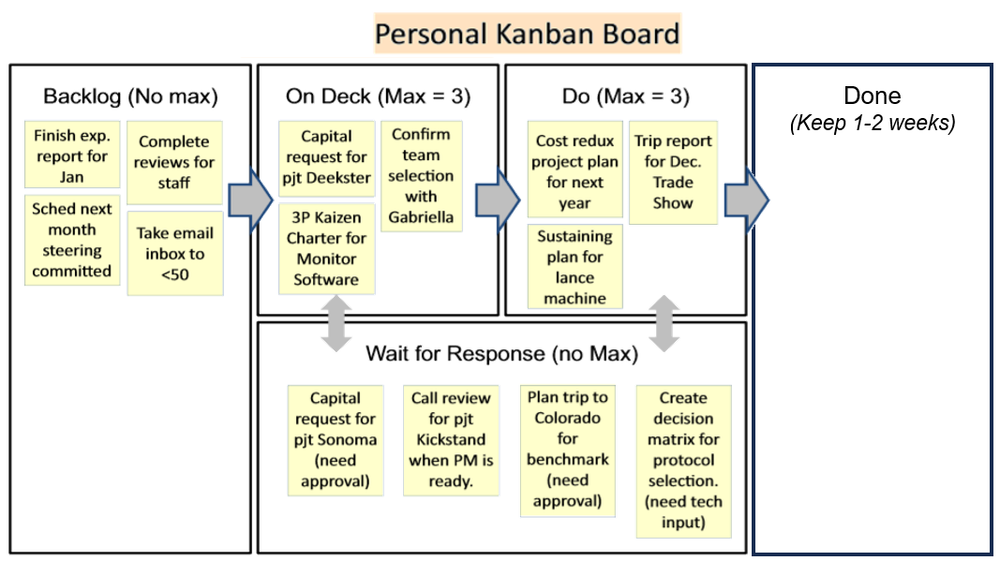

# Personal Kanban

## Why Start Personal?

**Kanban doesn't require a full team launch.** You can start alone and demonstrate value before expanding to team implementation.

## Simple Setup

### Materials Needed
- **4 sheets of printer paper**
- **Stack of sticky notes**  
- **Pen or marker**
- **Desk space** where board stays visible

### Basic Category Structure

| Column | Purpose | Typical Limit |
|--------|---------|---------------|
| **Backlog** | All tasks and ideas | Unlimited |
| **On Deck** | Next 3-5 tasks ready to start | 3-5 items |
| **Doing** | Active work | 1-2 items |
| **Waiting** | Blocked or awaiting response | No limit |
| **Done** | Completed tasks | Clear weekly |

### Pro Tip: Add "Waiting on Response"
- **Why?** Personal boards flow in days, people reply in weeks
- **Benefit**: Keeps follow-ups visible
- **Action**: Regular check-ins on waiting items

## Immediate Benefits

### Day 1 Results
- **Clear visual flow** of all work
- **Reduced multitasking** through WIP limits
- **Faster bottleneck identification**
- **Visible prioritization** (even to yourself)

### Week 1 Results  
- Better sense of actual capacity
- Improved focus on single tasks
- Clear communication with others about workload
- Reduced stress from "forgetting" tasks

### Month 1 Results
- Data on actual task completion rates
- Pattern recognition for common bottlenecks
- Better estimation of time requirements
- Improved stakeholder management

## Setup Instructions

### Step 1: Create Physical Board
1. **Tape 4 sheets** of paper horizontally on wall beside desk
2. **Write column headers** with marker
3. **Place sticky note pad** and pen nearby
4. **Position where you can't ignore it**

### Step 2: Populate Backlog
- **Write each task** on separate sticky note
- **Include everything**: emails to send, reports to write, calls to make
- **Don't prioritize yet** — just capture

### Step 3: Set Initial Limits
- **On Deck**: 3-5 tasks maximum
- **Doing**: 2-3 tasks maximum  
- **Start conservative** — you can adjust later

### Step 4: Begin Flow
1. **Pull highest-priority task** from Backlog to On Deck
2. **Start one task** by moving to Doing
3. **Complete task** before starting next
4. **Move completed work** to Done
5. **Pull next task** when capacity available

## Personal Board Variations

### For Different Work Types

#### Knowledge Worker Board
- Backlog → Research → Writing → Review → Done

#### Customer Service Board  
- Requests → Investigating → Responding → Awaiting → Resolved

#### Creative Work Board
- Ideas → Planning → Creating → Feedback → Published

### Advanced Personal Features

#### Time Tracking
- Add **start date** to sticky notes
- Calculate **cycle time** for different task types
- Identify **personal productivity patterns**

#### Priority Indicators
- **Red dots**: Urgent tasks
- **Blue dots**: Important but not urgent
- **Green dots**: Nice-to-have tasks

#### Blocking Indicators
- **Yellow sticky**: Waiting on others
- **Orange sticky**: Waiting on information
- **Pink sticky**: Waiting on decisions

## Common Personal Kanban Mistakes

### Mistake #1: No WIP Limits
**Problem**: Board becomes overwhelming to-do list
**Solution**: Enforce strict limits on Doing and On Deck columns

### Mistake #2: Ignoring Waiting Column
**Problem**: Blocked work disappears from view  
**Solution**: Regular review and follow-up on waiting items

### Mistake #3: Never Clearing Done
**Problem**: Board becomes cluttered and demotivating
**Solution**: Weekly clearing of Done column (take photo first if needed)

### Mistake #4: Perfect Cards
**Problem**: Spending too much time writing detailed cards
**Solution**: Quick notes only — you know what you meant

## Personal Metrics to Track

### Basic Measurements
- **Tasks completed per week**
- **Average time in Doing column**  
- **Number of items in Waiting**
- **Backlog growth rate**

### Advanced Measurements  
- **Cycle time by task type**
- **Percentage of tasks requiring rework**
- **Time spent on planned vs. unplanned work**
- **Interruption frequency and impact**

## Scaling to Team

### When Personal Kanban Works Well
Signs you're ready to introduce team Kanban:
- Personal board flows smoothly for a month or two
- You've developed WIP discipline
- Stakeholders notice improved responsiveness
- You can explain Kanban benefits clearly

## Troubleshooting

### "Too Many Urgent Tasks"
- **Review true urgency** — most "urgent" tasks aren't
- **Communicate capacity limits** to stakeholders
- **Negotiate priorities** rather than accepting everything

### "Tasks Too Large for Cards"
- **Break down large tasks** into smaller pieces
- **Each card should be completable in 1-2 days**
- **Create project cards** with sub-task tracking

### "Waiting Column Always Full"
- **Set follow-up reminders** for waiting items
- **Communicate expected response times**
- **Escalate persistently blocked work**

## Success Stories

### Developer Example
*"Started with paper board beside my monitor. Within a month, I was completing 40% more tasks and felt much less stressed. The visual flow made it obvious when I was taking on too much."*

### Manager Example  
*"Personal Kanban helped me balance strategic work with daily firefighting. The Waiting column was a game-changer — I stopped losing track of delegated work."*

---
*Personal Kanban is often the gateway to organizational transformation. Start with yourself, prove the value, then scale.*