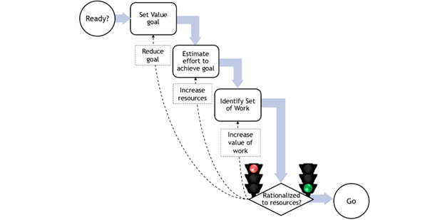
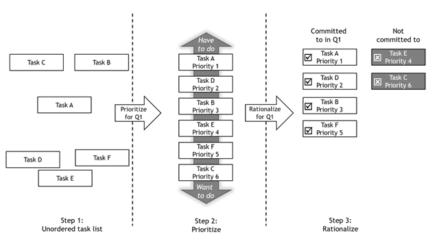

# Rationalization

## What Is Rationalization?

**Rationalization** is the practice of matching workload to capacity. It’s how teams stay focused, deliver reliably, and avoid burnout. At its core is a simple but critical principle: never agree to work that exceeds what your team can realistically deliver.

## Why Teams Avoid Rationalization
If workload rationalization is so critical, why do teams avoid it? The answer often lies in the messy realities of organizational life. Pressure from leadership, demanding customers, and reward systems that favor urgency over clarity all create strong headwinds. In this section, we look at the common obstacles teams face — and the very real costs of saying yes to everything.

### Common Obstacles
- Boss pushes for unrealistic commitments
- Customers insist on impossible timelines  
- Loudest voice often wins decisions
- System rewards forcefulness over logic

### The Cost of Saying Yes to Everything
- Missed deadlines become routine
- Poor effciency due to high multi-tasking and constant need to explain delays
- Quality suffers under pressure
- Team morale deteriorates when they sense they are not meeting expectations.

## Ruthless Rationalization
Ruthless Rationalization isn’t about saying no to hard work — it’s about refusing to lie to yourself, your team, or your stakeholders. At its core, it means committing only to what’s truly possible. This mindset isn’t negative or defeatist; it’s responsible. Without it, even well-intentioned teams slip into a cycle of overcommitment, missed deadlines, and lost trust.

### Core Mindset
**Never commit to deadlines you know you can't meet** — this is a form of misrepresentation that hurts everyone.

### Three-Step Process

1. **Set Clear Goal**
   - Define measurable results: tasks/week, revenue targets, compliance deadlines
   - Frame in business value terms

2. **Select the Work**  
   - Choose specific task set needed to meet goal
   - Be explicit about inclusions and exclusions

3. **Check the Fit**
   - Match resources to selected work
   - If mismatch exists, take action:
     - Renegotiate the goal
     - Add resources  
     - Replace low-value work with high-value alternatives

### The Traffic Light Rule
This diagram illustrates the Rationalized Planning Loop — a disciplined approach to aligning work with available resources before committing. The process begins with setting a value-based goal, then estimating the effort needed to achieve it. If the effort exceeds capacity, the team has three rational options: reduce the goal, increase resources, or increase the value of work by narrowing scope. The loop continues until the planned work is genuinely rationalized to the resources available. Only then does the traffic light turn green — signaling it's responsible to proceed. Anything less sets the team up for overload, missed deadlines, or diminished quality.

**Red Light = Stop & Fix**
- Unrationalized workload triggers immediate halt
- No forward progress until capacity matches commitment
- Forces organizational conversation about priorities

## Just-in-Time Rationalization
Just-in-Time Rationalization means delaying detailed planning until a task is about to begin. When tasks are short and decoupled, there's no need to fully plan everything upfront — and doing so often leads to wasted effort. By waiting, teams plan with the most current information, reducing guesswork and avoiding rework when conditions change. The key is to stay disciplined: only rationalize the next set of work that's ready to flow, not the entire backlog. This keeps plans relevant and resources aligned without constant replanning.

### When to Use
- Teams receive requests from multiple departments
- Requesters don't coordinate priorities among themselves
- High variability in task types and urgency

### The Process
This diagram shows how teams move from chaos to clarity using a three-step rationalization process. Instead of committing to everything, the team first acknowledges capacity limits. Then, they prioritize work based on value — not noise or politics. Finally, they commit only to the highest-value tasks that fit within available resources. If the selected work can’t meet goals, the team doesn't overextend — they escalate. This disciplined approach protects delivery, focus, and trust.

#### Step 1: Assume Capacity Constraints
- Start with ALL incoming tasks
- **Default assumption**: They can't all be done

#### Step 2: Value-Based Selection
1. Rank tasks by business value
2. Fill team capacity with highest-value work
3. Step back and evaluate: Does selected set meet organizational goals?

#### Step 3: Validate or Escalate
- **If goals met**: Proceed with selected work
- **If goals not met**: Reselect work or escalate to leadership

### Beyond Simple Force Ranking

**Force ranking** (1, 2, 3, 4...) oversimplifies the process.

**Real prioritization** considers:
- Resource availability after higher-priority tasks
- Task interdependencies  
- Skill set requirements
- Timeline constraints

**Example**: After resourcing Tasks 1-3, remaining capacity might fit Task 6 but not Task 4. Task 6 gets selected despite lower numerical priority.

**Key Insight**: Difference between prioritized workload vs. rationalized workload.

## Home Analogy
Rationalization isn’t a foreign concept — we do it instinctively with a home budget. Most people pay the mortgage before booking a trip, weigh today’s expenses against long-term plans, and make daily trade-offs based on what matters most. The difference at work isn’t the logic — it’s the complexity. While home decisions are usually made by one or two people, workplace priorities require alignment across teams, functions, and leadership. That makes rationalization at work harder — but no less essential.

### Work vs. Home Difference
- **Home**: 1-2 people set priorities
- **Work**: Larger group consensus required

**Principle remains the same**: You can't do everything, so do what matters most.

## Dealing with Uncertainty
Perfect forecasting is a myth — but that’s no excuse for skipping planning. In the real world, workloads fluctuate, surprises happen, and estimates miss the mark. Still, professionals don’t abandon structure; they plan with the best information available, track reality against expectations, and improve over time. The goal isn’t certainty — it’s readiness. Even under uncertainty, disciplined planning separates effective teams from chaotic ones.

### Reality Check
Workload forecasting isn't perfect:
- Flow patterns vary unpredictably
- Emergencies disrupt plans
- Estimates are frequently wrong

### Professional Response
- Estimate as accurately as possible
- Track actual performance vs. estimates
- Improve forecasting through experience
- **Never use imperfect knowledge as excuse for no planning**

eisenhower's famous quote about planning expresses that the process of planning prepares you for uncertainty — not that your initial plan will survive contact with reality in tact.

> **“Plans are worthless, but planning is everything.”**  
> — *Dwight D. Eisenhower*

## Case Study: Developer's No-Win Day
Even the best developers can find themselves in no-win situations when workloads aren’t rationalized. In this brief case study, we follow a typical morning for Hannah, a capable and committed software engineer. Despite thoughtful planning, she misses a critical noon deadline — not because of poor performance, but because of systemic overload, shifting priorities, and uncoordinated interruptions. Her story reveals how hidden waste accumulates and undermines delivery, even when every task seems justified.

### The Scenario: Hannah's Morning
**8:00 AM** - Plans 4 hours for 2-hour screen update (due at noon)

**8:20 AM** - "Critical" website bug reported (estimates 1 hour)

**9:30 AM** - Interrupted by project status meeting (20 minutes lost)

**10:00 AM** - Bug fix works on US site, fails on EU site (must restart)

**10:30 AM** - Pulled into customer security call

**12:30 PM** - Deadline missed, ad campaign delayed 2 months

### Root Causes
- No visible priority system
- Multiple stakeholders making independent demands  
- No mechanism for conflict resolution
- "Urgent" work that had been live for months unnoticed

### Prevention Through Rationalization
- Clear priority communication system
- Stakeholder coordination process
- Visible workload management
- Protected time for committed deliverables

---

## Next Steps
- [Kanban Basics](kanban_basics_wiki) - Learn the visual system that enables rationalization
- [Board Design](kanban_board_design_wiki) - Set up your Kanban board structure
- [Personal Kanban](kanban_personal_wiki) - Start with individual implementation

---
