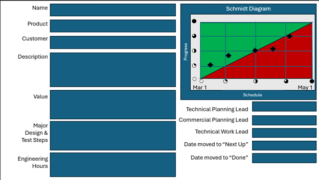
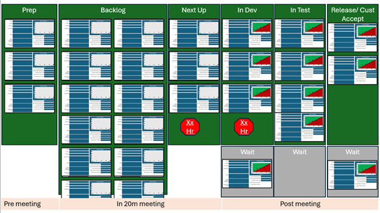

# Customizing Kanban for Sustaining Projects

## What Are Sustaining Projects?

**Sustaining work** differs from typical Kanban tasks — it's often urgent, cross-functional, and scattered across various systems and stakeholders.

### Common Types
- **Cost-out efforts** — Reducing product/service costs
- **Quality-driven design changes** — Improving reliability
- **Obsolescence management** — Replacing discontinued components  
- **Customer complaints** — Addressing satisfaction issues
- **Documentation updates** — Maintaining accuracy
- **Training materials** — Keeping content current

### Why They Matter
- **Critical to customer satisfaction**
- **Essential for product quality**  
- **Required for operational continuity**
- **Often regulatory or compliance-driven**

## The Challenge with Sustaining Work

### Characteristics That Make It Difficult
- **Smaller than full-scale projects** — Don't fit traditional PM methods
- **More interrupt-driven** — Arrive unpredictably
- **Cross-disciplinary** — Require multiple skill sets
- **Rarely tracked formally** — Fall between organizational cracks

### Common Problems
- **Teams overload** from unmanaged demand
- **Priorities blur** without clear frameworks
- **Strategic effort buried** under reactive noise
- **No visibility** into overall sustaining portfolio

## Enhanced Kanban Card Design



### Standard Card Elements

#### Essential Information
- **Project Title** — Clear, concise description
- **Business Case** — Why this matters (customer impact, cost savings, compliance)
- **Requestor** — Who needs this completed
- **Target Date** — When completion is needed
- **Progress Charts** — Simple visual showing completion percentage.  The example here, called a Schmidt Diagram, is an intuitive way to show progress.  A person can easily scan a board with dozens of cards for overall progress. Note that the Schmidt Diagram is not relevant until a card is pulled into "Next Up".

#### Tracking Elements
- **KPI Tags** — Categories for reporting (quality, cost, compliance)
- **Effort Estimate** — High-level sizing (S/M/L)
- **Skills Required** — What expertise is needed
- **Dependencies** — External requirements or blockers

### Benefits of Enhanced Cards
- **Improved prioritization** during planning meetings
- **Better handoffs** between functions
- **Clearer reporting** to leadership
- **Faster decision-making** with visible context

## Expanded Board Layout



### Additional Columns for Sustaining Work

#### Prep Column
- **Purpose**: Clarify work before commitment
- **Activities**: Requirements gathering, initial research, rough estimation
- **Output**: Tasks ready for "Next Up" with clear scope
- **Benefit**: Prevents poorly-defined work from consuming team capacity

#### Release/Acceptance Column  
- **Purpose**: Final customer/stakeholder sign-off
- **Activities**: User acceptance testing, documentation review, training delivery
- **Success Criteria**: Clear acceptance criteria defined upfront
- **Risk Management**: Prevents "90% done" syndrome

### Wait Rows (Horizontal Swim Lanes)

#### Purpose of Wait States
- **Make blockers obvious** — Can't ignore waiting work
- **Trigger follow-up actions** — Regular review of blocked items
- **Prevent black holes** — Work doesn't disappear when blocked
- **Enable analysis** — Understand common blocking patterns

#### Types of Wait States
- **Waiting on Approval** — Management or regulatory sign-off
- **Waiting on Information** — Customer requirements, technical specs
- **Waiting on Dependencies** — Other teams, external vendors
- **Waiting on Resources** — Budget approval, equipment, personnel

## Sustaining-Specific Metrics

### Operational Metrics
- **Customer satisfaction scores** — Impact of sustaining work
- **Compliance status** — Regulatory requirements met
- **Cost savings delivered** — Financial impact measurement
- **Quality improvements** — Defect reduction, reliability gains
- **Response time to issues** — Speed of sustaining work delivery

### Flow Metrics
- **Cycle time by work type** — Different sustaining categories
- **Blocking frequency** — How often work gets stuck
- **Rework percentage** — Quality of initial completion
- **Capacity utilization** — Planned vs. unplanned work ratio

## Sustaining Work Categories

### Urgent/Reactive
- **Customer escalations** requiring immediate attention
- **Regulatory compliance** with fixed deadlines
- **Safety issues** needing rapid resolution
- **System outages** or critical failures

#### Board Treatment
- **Express lane** through workflow
- **Dedicated WIP capacity** (reserve slots)
- **Clear escalation paths** for approvals
- **Accelerated review cycles**

### Planned/Strategic  
- **Process improvements** with business cases
- **Technology refresh** projects
- **Preventive maintenance** initiatives
- **Training and development** programs

#### Board Treatment
- **Standard workflow** through all stages
- **Full business case** development
- **Regular prioritization** in weekly meetings
- **Measured against strategic goals**

### Maintenance/Operational
- **Documentation updates** for accuracy
- **System patches** and minor updates
- **Routine compliance** activities
- **Standard operating procedures** updates

## Cross-Functional Coordination

### Challenge: Multiple Skill Sets
Sustaining projects often require:
- **Engineering** — Technical implementation
- **Quality** — Testing and validation  
- **Operations** — Process changes
- **Compliance** — Regulatory review
- **Training** — Documentation and education

### Solution: Skill-Based Swim Lanes

#### Board Organization
```
                 Prep → Next Up → In Progress → Review → Done
Engineering      [  ] → [    ] → [      ] → [   ] → [ ]
Quality          [  ] → [    ] → [      ] → [   ] → [ ]  
Operations       [  ] → [    ] → [      ] → [   ] → [ ]
Compliance       [  ] → [    ] → [      ] → [   ] → [ ]
```

#### Benefits
- **Clear ownership** at each stage
- **Visible handoffs** between functions
- **Balanced workload** across skill sets
- **Reduced bottlenecks** from single-skill dependencies

## Sustaining Project Templates

### Template 1: Customer Issue Resolution
- **Card Elements**: Customer ID, Issue Category, Impact Level, Root Cause
- **Workflow**: Report → Investigate → Fix → Test → Deploy → Verify
- **Success Metrics**: Resolution time, Customer satisfaction, Recurrence rate

### Template 2: Compliance Update
- **Card Elements**: Regulation Reference, Deadline, Affected Systems, Risk Level
- **Workflow**: Review → Plan → Implement → Validate → Document → Audit
- **Success Metrics**: On-time completion, Audit results, Cost impact

### Template 3: Cost Reduction Initiative  
- **Card Elements**: Current Cost, Target Savings, Implementation Effort, Risk Assessment
- **Workflow**: Analyze → Design → Approve → Implement → Measure → Report
- **Success Metrics**: Actual savings, Implementation cost, Timeline adherence

## Sustaining Work Antipatterns

### Antipattern 1: Everything is Urgent
- **Problem**: No real prioritization, everything marked high priority
- **Solution**: Force ranking with business justification required

### Antipattern 2: Invisible Technical Debt
- **Problem**: Important maintenance work not visible to stakeholders
- **Solution**: Dedicated swim lane for technical debt with business case translation

### Antipattern 3: Hero Culture  
- **Problem**: Relying on individuals to handle all sustaining work
- **Solution**: Cross-training and documented processes for knowledge sharing

### Antipattern 4: No Success Metrics
- **Problem**: Can't demonstrate value of sustaining work
- **Solution**: Define and track business impact metrics for each category

## Integration with Strategic Planning

### Quarterly Planning Alignment
- **Strategic initiatives** get dedicated capacity
- **Sustaining work** fills remaining capacity
- **Balance maintained** between new and sustaining work

### Capacity Allocation Model
- **60% planned sustaining** work (known maintenance, compliance)
- **25% strategic initiatives** (new capabilities, major improvements)
- **15% reactive/urgent** work (customer issues, emergencies)

### Success Indicators
- **Predictable delivery** of sustaining commitments
- **Reduced firefighting** from preventive maintenance
- **Improved customer satisfaction** from quality focus
- **Lower total cost of ownership** from efficiency gains

---

## Next Steps
- [Dashboards](kanban_dashboards_wiki) — Track sustaining work performance
- [Performance](kanban_performance_wiki) — Measure and improve sustaining outcomes

---

*Sustaining projects are critical business activities that deserve the same management rigor as new development work. Kanban provides the visibility and control needed to excel at both.*